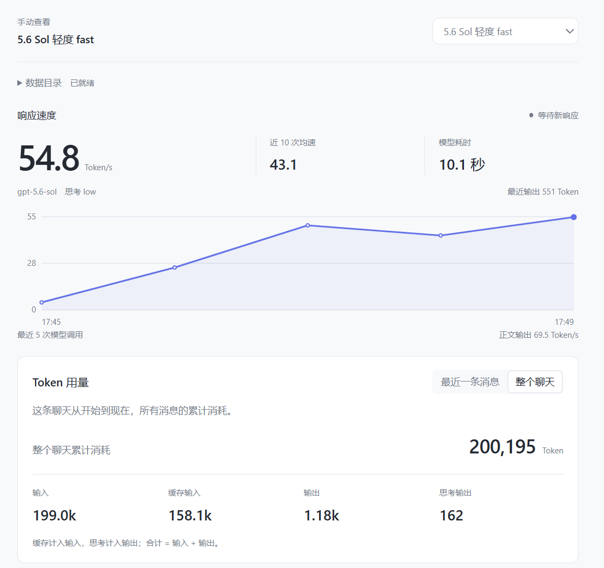
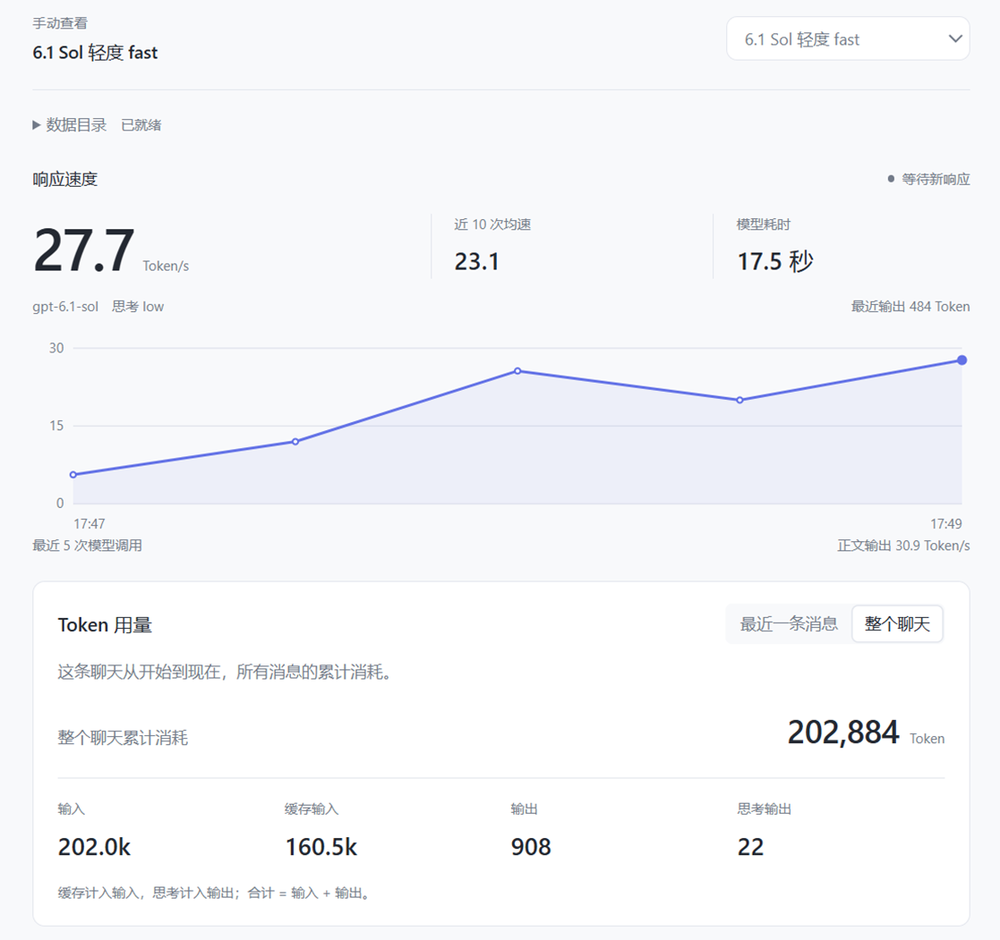

# Codex Pulse

本地 Codex 响应速度与 Token 用量面板。在浏览器或 Codex 侧栏选择聊天，查看它的速度、趋势、输入、缓存输入、输出和思考输出。


#### GPT 5.6 Sol fast 模式下，平均 43.1 Token/s。



#### GPT 6.1 Sol fast 模式下，平均 23.1 Token/s



## 下载使用

1. 打开 [Releases 下载页](https://github.com/Yamazzzx/codex-speed-panel/releases)，下载文件名带 `windows-x64` 的 ZIP。
2. 完整解压，双击 `CodexSpeedPanel.exe`。无需安装 Python、管理员权限或 API Key。
3. 程序会检查少数候选数据目录并打开本地网页。从顶部菜单选择要查看的聊天。
4. 使用结束后，点击“关闭监测”或运行 `关闭监测.cmd`。

电脑需要已经安装并使用过 Codex。提供 Windows x64 免安装包；macOS 提供实验性源码启动方式，尚未在 Mac 实机验证。

如需在 Codex 侧栏查看，可让 Codex 打开 `http://127.0.0.1:19876/`。

## 让 Codex 安装

将仓库链接交给 Codex，并输入：

> 请按仓库中的 INSTALL.md 安装 Windows 版，校验下载包后解压、启动，并在侧栏打开面板。

具体步骤见 [INSTALL.md](INSTALL.md)。

## 数据目录

启动时优先使用 `--codex-home` 或 `CODEX_HOME`，未指定时检查当前用户的 `~/.codex` 和少数平台候选目录。只检查这些目录及数据库结构，不扫描整个硬盘，不持续搜索目录。官方默认目录见 [OpenAI 配置文档](https://learn.chatgpt.com/docs/config-file/config-advanced#config-and-state-locations)。

没有找到、没有读取权限或数据库格式不匹配时，在网页的“数据目录”中手动填写目录，也可点击“重新检测”。手动设置只对本次运行有效。

## 统计怎么看

- **最近一条消息**：最近发出的那条消息，以及处理这条消息时全部模型调用的消耗。
- **整个聊天**：当前聊天从开始到现在的累计消耗。
- **输入与缓存**：缓存输入已经包含在输入中。
- **输出与思考**：思考输出已经包含在输出中。
- **合计**：输入加输出，不再重复加缓存和思考。

明细默认按消息汇总，可切换到模型调用明细。点击行首箭头查看各项用量；悬停数字可看完整值。`k` 表示千，`M` 表示百万。

响应速度为输出 Token 数除以模型请求耗时，包含思考和首个输出前的等待，排除工具执行时间。近 10 次均速按各次输出与耗时加权计算。“正文输出”仅在日志能够区分完整正文时显示，是客户端观测近似值。

面板每 3 秒刷新一次，页面隐藏时不再发起读取。数据文件未变化时复用统计结果。用量随模型调用结束更新，记录缺失时显示空值或提示记录不完整。累计消耗不代表当前上下文长度或套餐剩余额度。

## 数据与隐私

数据在本机处理。服务仅监听 `127.0.0.1`，以只读方式打开 Codex 数据库，不读取登录凭证，不上传聊天数据，不调用模型 API。

真实聊天名称和用量可能显示在面板中，分享截图前需检查。本文预览图使用合成数据；打开 `http://127.0.0.1:19876/?demo=1` 可查看演示。详见 [PRIVACY.md](PRIVACY.md)。

工具仅按所选聊天编号读取本地记录，不扫描 Codex 窗口、不启动无障碍扫描进程。后台仍占用少量内存，关闭网页不会自动退出服务；用完请点击“关闭监测”。日志格式随 Codex 更新可能变化。该项目与 OpenAI 无隶属关系。

## 从源码运行

需要 Python 3.10 或更新版本，运行时无需安装第三方 Python 依赖。

下载源码后双击 `start.cmd`，或运行 `python server.py`。使用 `stop.cmd` 停止源码版服务。

macOS 同样需要 Python 3.10 或更新版本。在终端运行 `python3 server.py`，或使用 `start.command`。若启动脚本没有执行权限，先运行 `chmod +x start.command stop.command`；停止服务可使用 `stop.command`。详细步骤见 [INSTALL.md](INSTALL.md)。

数据目录会在启动时自动检查，也可通过 `CODEX_HOME` 或 `--codex-home` 指定。端口可通过 `--port` 指定。

## 开发与构建

```sh
python -B -m unittest -v test_monitor.py
python -B package_release.py
python -m pip install -r requirements-build.txt
python -B build_windows.py
```

Windows 构建需使用 64 位 Python。生成的源码 ZIP、Windows ZIP 和统一的 `SHA256SUMS.txt` 位于 `.release/`。源码打包采用文件白名单，并检查常见私人路径、会话编号和凭证格式。

## License

采用 [MIT 许可证](LICENSE)。欢迎通过 Issue 和 Pull Request 反馈问题或改进代码。
